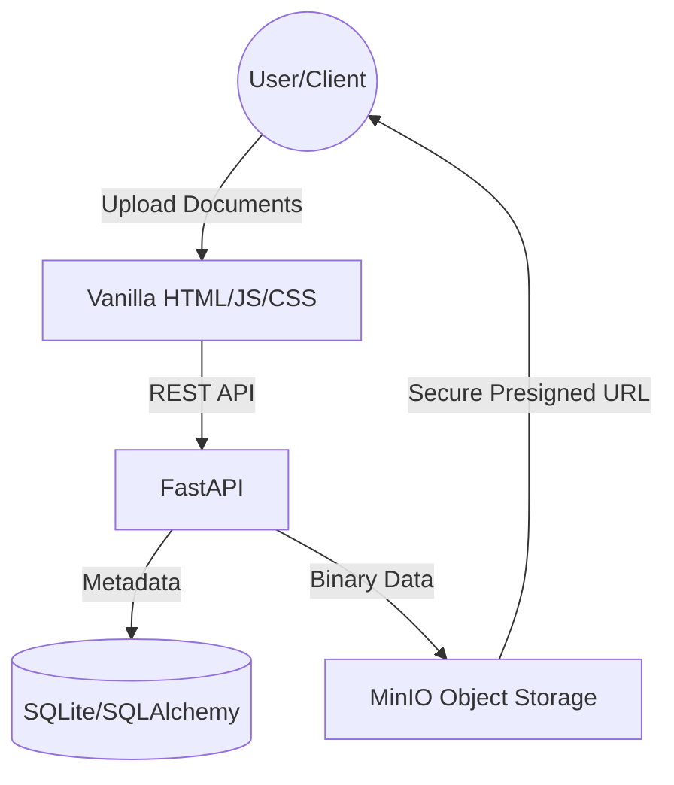

# DocVault: Professional Technical Documentation

## 1. Project Overview
DocVault is a specialized document management and archival system designed to handle regulatory filings and official documents (Acts, Rules, Notifications, etc.). It serves as a robust, high-performance alternative to traditional scraping-based data collection methods, particularly for portals like the **Ministry of Corporate Affairs (MCA)**.

## 2. Why DocVault was Built?
The primary driver for building DocVault is the increasing difficulty of scraping data from official regulatory portals.

### The MCA Scraping Challenge:
- **Strict Anti-Scraping Measures**: Portals like MCA implement sophisticated rate-limiting, CAPTCHAs, and IP blocking.
- **Dynamic Content**: Heavy reliance on JavaScript and dynamic rendering makes traditional scraping fragile and prone to failure.
- **Legal & Compliance Risks**: Scraping often violates Terms of Service and can lead to legal complications.
- **Data Integrity**: Automated scrapers can easily misinterpret data if the site structure changes unexpectedly.

## 3. How DocVault Solves the Scraping Issue
Instead of fighting against anti-scraping measures, DocVault shifts the paradigm toward **Client-Side Data Capture & Secure Archival**.

### The Solution: "Temporary Data Capture"
DocVault enables a workflow where the data is "taken temporarily" from the client side:
1. **Manual/Assisted Selection**: Instead of an automated bot hitting the portal, the system accepts documents directly from the authorized user/client who already has legitimate access to the portal.
2. **Standardized Metadata**: The user provides the classification (Subdomain), Title, and Issue Date along with the document.
3. **Immutable Storage**: Once captured, the document is stored in **MinIO Object Storage**, effectively "thawing" the data from the difficult-to-access portal and into a high-availability private archive.
4. **Presigned Access**: To ensure security while allowing ease of use, DocVault provides **Temporary Presigned URLs**. These URLs grant secured, time-limited (1-hour) access to the documents, solving the issue of making the data available to stakeholders without exposing the entire storage bucket.

## 4. Technical Architecture
DocVault is built on a modern, decoupled stack to ensure scalability and visual excellence.

### Key Components:
- **Backend (FastAPI)**: Handles high-concurrency uploads and metadata management.
- **Frontend (Premium UI)**: A glassmorphic, dark-themed dashboard that provides a premium user experience.
- **Storage (MinIO)**: S3-compatible object storage that keeps PDFs secure and organized.
- **Database (SQLite)**: Stores relational metadata for fast searching and categorization.

## 5. Value Proposition
- **Reliability**: No more broken scrapers. The data is always there because it was archived at the source.
- **Speed**: Access documents via high-speed object storage instead of waiting for slow portal loads.
- **Security**: Granular control over who can view what, using time-limited access tokens.
- **Categorization**: Auto-groups documents into Acts, Rules, Master Circulars, etc., for instant retrieval.

---
*DocVault: Turning regulatory compliance into a seamless digital asset.*
