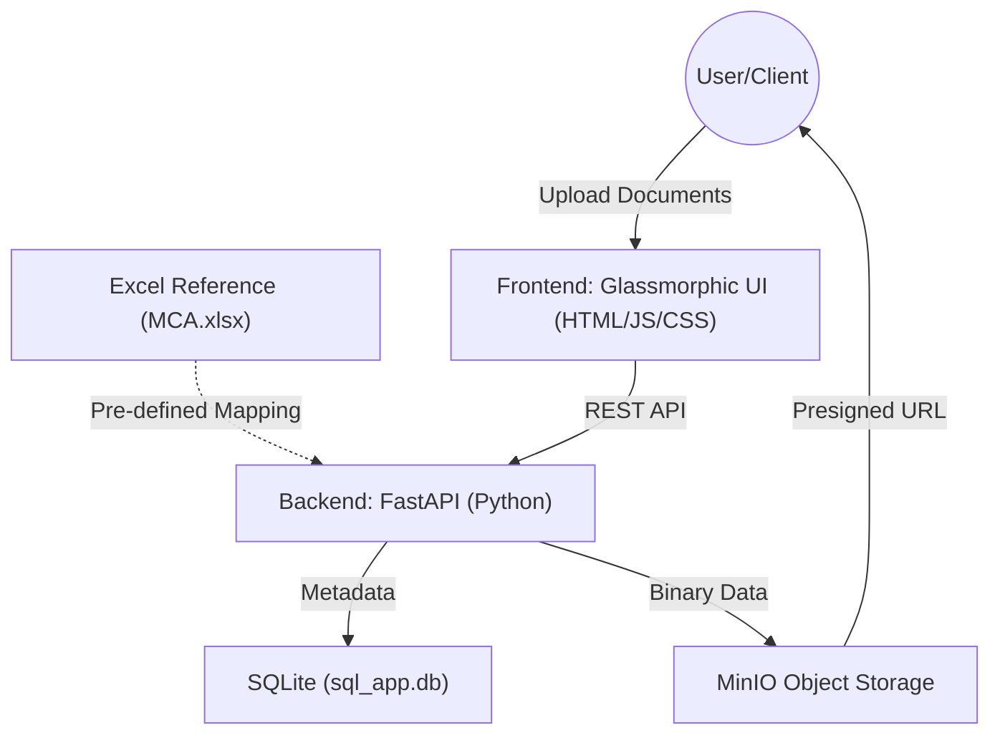

# DocVault: Professional Technical Documentation

## 1. Project Overview
DocVault is a specialized document management and archival system designed to handle regulatory filings and official documents (Acts, Rules, Notifications, etc.). It provides a reliable, secure, and high‑performance alternative to traditional scraping‑based data collection methods, especially for portals like the **Ministry of Corporate Affairs (MCA)**.

## 2. Why DocVault Was Built
The primary driver for building DocVault is the increasing difficulty of scraping data from official regulatory portals:
- **Strict Anti‑Scraping Measures** – rate‑limiting, CAPTCHAs, IP blocking.
- **Dynamic Content** – heavy reliance on JavaScript makes scrapers fragile.
- **Legal & Compliance Risks** – scraping often violates Terms of Service.
- **Data Integrity** – automated scrapers can misinterpret data when site structures change.

## 3. Core Solution – "Temporary Data Capture"
Instead of fighting anti‑scraping mechanisms, DocVault adopts a **client‑side data capture** approach:
1. **Manual/Assisted Selection** – Users upload documents they already have legitimate access to.
2. **Standardized Metadata** – Each upload includes Subdomain, Title, Issue Date, and optional tags.
3. **Immutable Storage** – Files are stored in **MinIO Object Storage**, providing S3‑compatible, high‑availability archival.
4. **Presigned Access** – Time‑limited (1‑hour) presigned URLs enable secure sharing without exposing the entire bucket.

## 4. Technical Architecture & Connectivity
DocVault is connected via two primary data sources plus object storage:
- **Data Source 1 (Reference)**: **`MCA.xlsx`** (provides URL mapping, sub-category definitions, and official categories).
- **Data Source 2 (Metadata)**: **`sql_app.db`** (SQLite database for dynamic metadata tracking).
- **File Storage**: **MinIO Object Storage** (for binary PDF storage).

### 4.1 Implementation of "Database Connectivity"
The "connection" between the two data sources is a **Logical Mapping** implemented at the backend layer.

1.  **Reference Definition**: The system uses **`MCA.xlsx`** as the ground truth for sub-category categorizations and official portal URLs.
2.  **Mapping Logic**: The FastAPI backend contains a `url_mapping` dictionary (derived from the Excel file).
3.  **Dynamic Intersection**: Upon document upload, the backend intercepts the `sub_category` provided by the user. It then:
    -   **Lookups**: Cross-references the `sub_category` against the `url_mapping` defined in the logic.
    -   **Enrichment**: Dynamically assigns the official MCA URL to that specific document record.
    -   **Persistence**: Finalizes the record by writing **both** the user-provided metadata and the Excel-sourced URL into the **SQLite Metadata DB**.

## 5. Data Flow
1. **User Upload** – User selects a file and metadata (Sub-category, Title, etc.) on the frontend.
2. **API Call** – Frontend sends a POST request to `/upload/`.
3. **Backend Processing**
   - **Validation**: Checks file type (PDF only).
   - **Logical Connection**: Connects the upload to its official category URL by matching the `sub_category` string.
   - **Storage**: Streams binary content to MinIO.
   - **Persistence**: Writes the final enriched record into the SQLite metadata table.
4. **Archival & Access** – When listing documents, the backend generates a valid **Presigned URL** (1-hour expiry) via MinIO.

## 6. Security Model
- **Endpoint Security**: REST API with CORS configured to only allow authorized access.
- **Object-Level Security**: Files are private in MinIO and only accessible via time-limited presigned URLs.
- **Transport Security**: All communication should use HTTPS for data in transit.

## 7. Deployment & Operations
- **Containerisation**: The system is designed to run with MinIO and a Python environment.
- **Environment Management**: Configuration for MinIO endpoints and database paths is managed via variables in `main.py`.
- **High Availability**: MinIO provides built-in redundancy for stored files.

---
*DocVault: Turning regulatory compliance into a seamless digital asset.*
