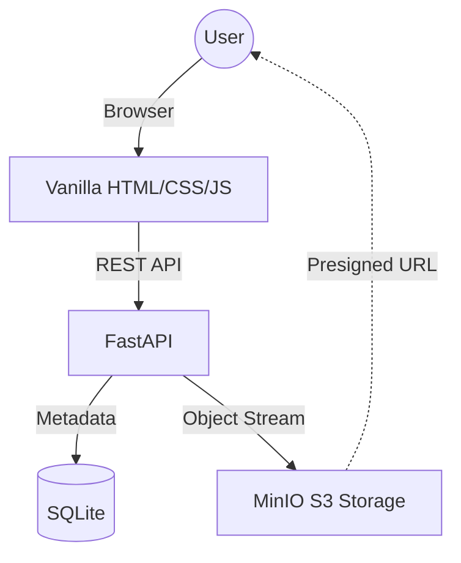

# DocVault | Secure Regulatory Document Archive

DocVault is a high-performance, premium-designed document management system tailored for regulatory and domain-related PDF storage. It provides a secure, archival-based alternative to the challenges of scraping regulatory portals like the MCA.

> [!IMPORTANT]
> **The MCA Scraping Solution**: This project was built to solve the issue of non-scrappable data on the MCA portal. Instead of unreliable scraping, DocVault uses client-side data capture and secure, temporary storage (MinIO) to provide a robust digital archive.

**[Read Detailed Documentation & MCA Strategy](file:///Users/apple/Desktop/DocVault/DOCUMENTATION.md)**

## 🚀 Key Features

- **Premium UI**: Modern dark theme with glassmorphism, smooth animations, and Plus Jakarta Sans typography.
- **MinIO Storage**: Secure object storage for PDF documents with automated bucket management.
- **Secure Retrieval**: Temporary high-security access using **Presigned URLs** (1-hour expiration).
- **Relational Metadata**: Document details (Categories, Dates, Titles) stored in SQLite via SQLAlchemy.
- **Categorization**: Specialized tracking for Acts, Rules, Forms, Notifications, Circulars, and more.
- **Responsive Design**: Fluid layout optimized for both desktop and tablet views.

---

## 🛠️ Technical Stack

- **Backend**: Python 3.10+ / FastAPI
- **Database**: SQLite (SQLAlchemy ORM)
- **Object Storage**: MinIO
- **Frontend**: Vanilla HTML5, CSS3, ES6 JavaScript
- **Styling**: Custom CSS Variables & Glassmorphism

---

## 📁 System Architecture



---

## ⚙️ Installation & Setup

### 1. Prerequisites
- Python 3.10+
- Docker (for MinIO)
- pip (Python Package Manager)

### 2. Start MinIO Storage
Run the following Docker command to start a MinIO instance with the required credentials:
```bash
docker run -d \
  --name minio \
  -p 9000:9000 \
  -p 9001:9001 \
  -v ~/minio/data:/data \
  -e MINIO_ROOT_USER=admin \
  -e MINIO_ROOT_PASSWORD=password123 \
  minio/minio server /data --console-address ":9001"
```

### 3. Clone and Setup Environment
```bash
# Navigate to project directory
cd "Mca Alternative"

# Create and activate virtual environment
python -m venv venv
source venv/bin/activate

# Install dependencies
pip install fastapi uvicorn sqlalchemy python-multipart minio
```

### 4. Run the Application
```bash
uvicorn backend.main:app --reload
```
The application will be available at: **`http://127.0.0.1:8000`**

---

## 📡 API Documentation

### **POST** `/upload/`
Uploads a document and its metadata.
- **Form Data**:
    - `subdomain`: (Acts, Rules, Forms, etc.)
    - `title`: Document title
    - `issue_date`: Date string
    - `file`: PDF file

### **GET** `/documents/`
Lists all documents with their metadata and a temporary presigned URL for viewing.

### **DELETE** `/documents/{document_id}`
Permanently removes the metadata from the database and the file from MinIO.

---

## 🎨 Design System

DocVault uses a professional design language:
- **Primary Palette**: Indigo (#6366f1) and Violet (#a855f7)
- **Background**: Deep Onyx (#050505) with radial gradients
- **Effects**: Backdrop-blur (16px), variable transparency, and micro-hover transitions.

---

## ⚖️ License
This project is developed as a secure alternative for document storage and management.
